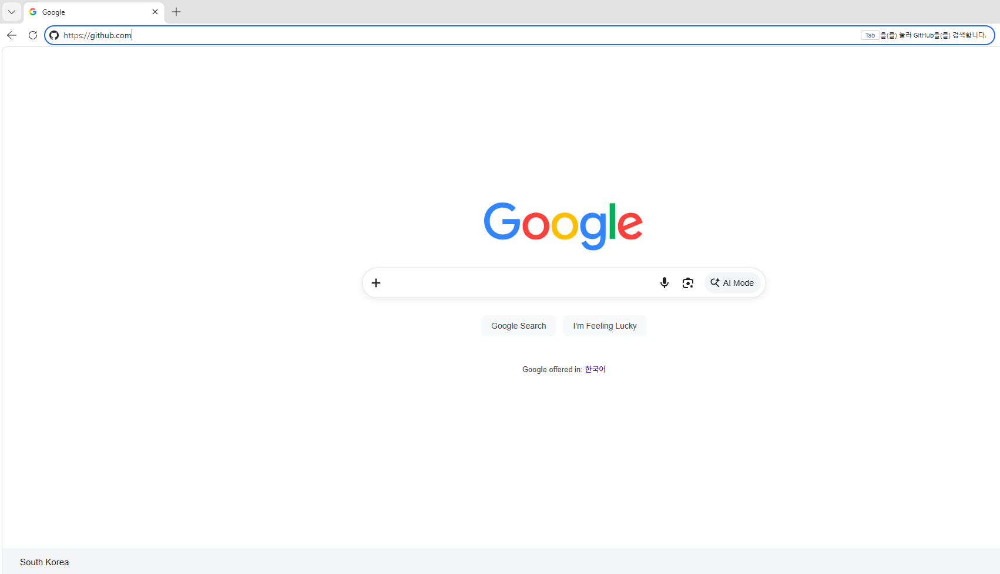
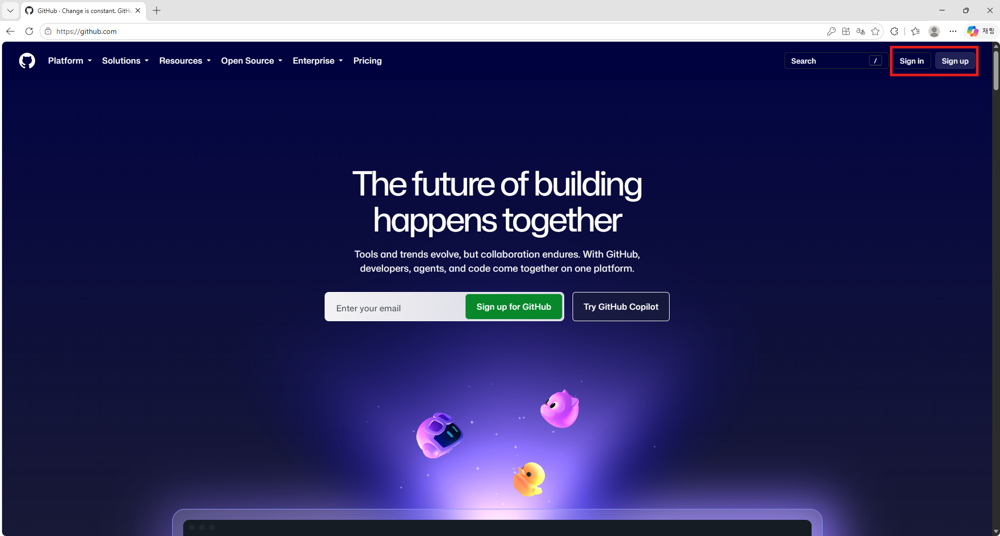
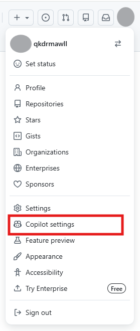
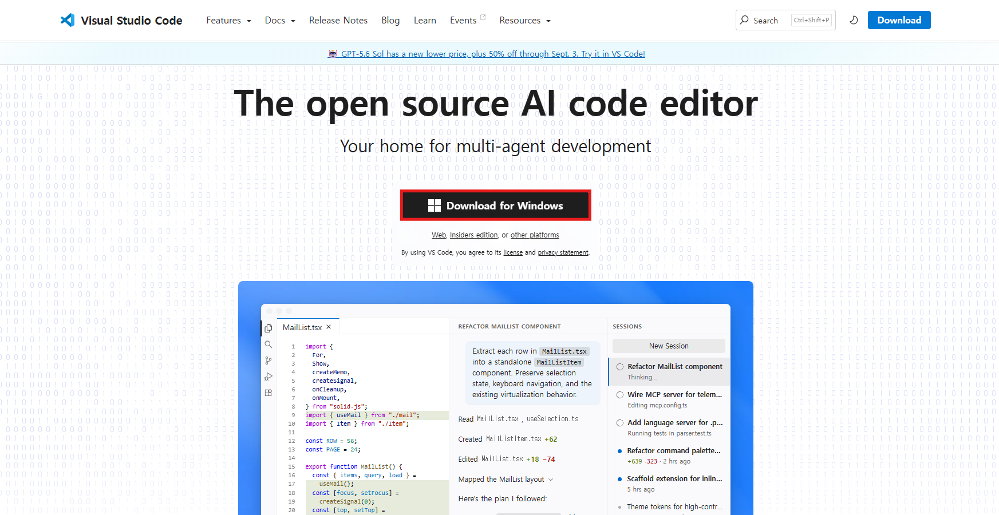
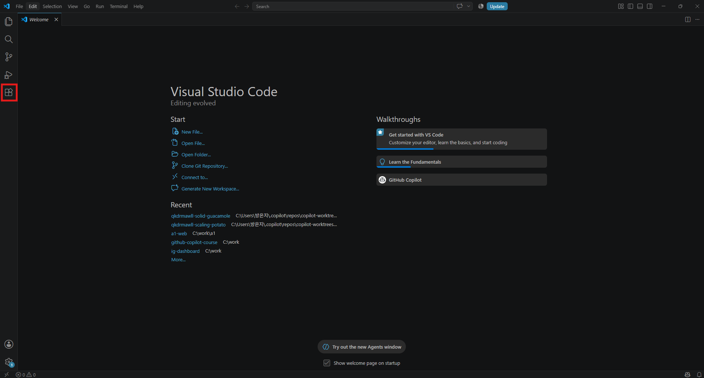
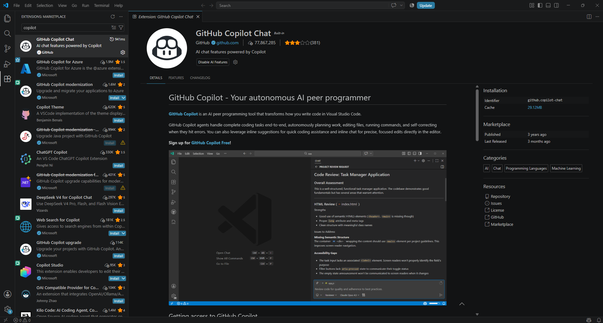
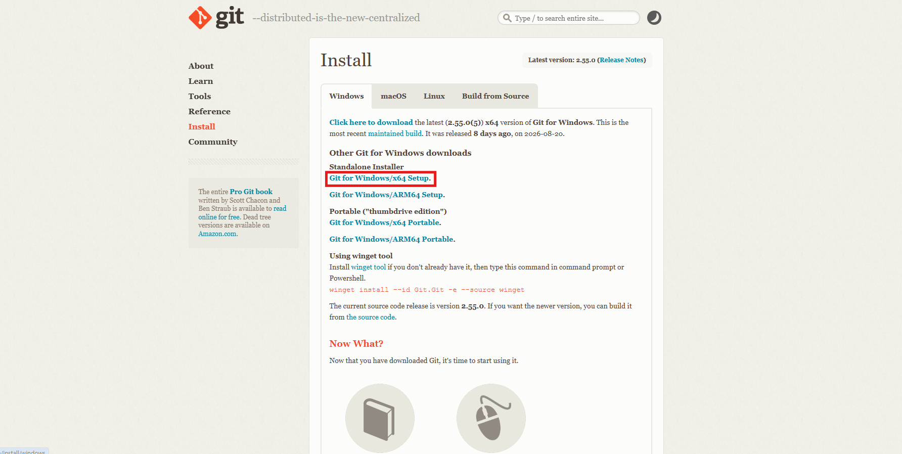

# STEP 00: 교육 환경 준비

## 학습 목표

수업에 필요한 GitHub 계정과 프로그램을 준비합니다. 행사 전에 미리 완료해 주세요.

## 오늘 사용하는 도구

| 도구 | 쉬운 설명 |
|---|---|
| GitHub | 만든 파일을 인터넷에 저장하고 공유하는 곳 |
| Visual Studio Code | 파일을 만들고 수정하는 편집 프로그램 |
| GitHub Copilot | 만들고 싶은 것을 텍스트로 입력하면 작업을 도와주는 AI |
| Git | 파일이 어떻게 바뀌었는지 기록하는 도구 |
| Node.js | 준비된 React 프로젝트를 내 컴퓨터에서 실행하는 데 필요한 프로그램 |

> [!TIP]
> 지금은 이름을 외우지 않아도 됩니다. 설치만 마치면 수업에서 하나씩 사용해 봅니다.

## GitHub 계정 만들기

### 1단계: GitHub 웹사이트 열기

Microsoft Edge 또는 Chrome을 열고 주소창에 [https://github.com](https://github.com)을 입력합니다.

### 2단계: 회원가입 시작하기

화면 오른쪽 위의 **Sign up** 버튼을 누릅니다. 이미 계정이 있다면 **Sign in**을 눌러 로그인합니다.

### 3단계: 계정 정보 입력하기

화면 안내에 따라 이메일 주소, 비밀번호, 사용자 이름을 입력합니다. 이메일로 받은 인증번호도 입력합니다.

### 4단계: Copilot 사용 확인하기

로그인한 뒤 GitHub Copilot을 사용할 수 있는 계정인지 확인합니다. 회사나 학교 계정이라면 담당자에게 Copilot 사용 권한이 있는지 물어보세요.

## Visual Studio Code 설치하기

### 1단계: 설치 파일 받기

[Visual Studio Code 웹사이트](https://code.visualstudio.com/)에서 자신의 운영체제에 맞는 설치 파일을 받습니다.

### 2단계: 설치하기

받은 파일을 실행하고 화면 안내에 따라 설치합니다. 설치가 끝나면 Visual Studio Code를 실행합니다.

## GitHub Copilot 설치하기

### 1단계: 확장 프로그램 화면 열기

Visual Studio Code 왼쪽 메뉴에서 네모 블록 모양의 **Extensions** 버튼을 누릅니다.

### 2단계: Copilot 검색하기

검색창에 `GitHub Copilot`을 입력합니다. 게시자가 GitHub인지 확인하고 **Install**을 누릅니다.

### 3단계: GitHub 로그인하기

로그인 안내가 나타나면 **Sign in to GitHub**를 누릅니다. 브라우저가 열리면 조금 전에 만든 GitHub 계정으로 로그인하고 연결을 허용합니다.

## Git 설치하기

[Git 다운로드 페이지](https://git-scm.com/downloads)에서 자신의 운영체제에 맞는 파일을 받아 설치합니다. 어떤 선택지를 골라야 할지 모르겠다면 기본값 그대로 **Next**를 눌러도 됩니다.

## Node.js 설치하기

### 1단계: 설치 파일 받기

[Node.js 다운로드 페이지](https://nodejs.org/en/download)에서 **LTS**라고 표시된 버전을 받습니다. LTS는 오랫동안 안정적으로 지원되는 버전이라는 뜻입니다.

### 2단계: 설치하기

받은 파일을 실행하고 기본 선택을 유지한 채 설치합니다. 설치가 끝나면 Visual Studio Code를 완전히 종료했다가 다시 실행합니다.

## Copilot 연결 확인하기

### 1단계: Visual Studio Code 열기

Visual Studio Code를 실행합니다. 아직 새 폴더를 만들 필요는 없습니다. 실습 프로젝트는 STEP 03에서 GitHub로부터 가져옵니다.

### 2단계: Copilot 확인하기

화면 위쪽이나 왼쪽에 있는 Copilot 아이콘을 눌러 채팅 창이 열리는지 확인합니다. 아직 질문을 입력하지 않아도 됩니다.

## 문제 해결 가이드

- Copilot 아이콘이 없다면 Visual Studio Code를 껐다가 다시 실행합니다.
- 로그인이 되지 않으면 브라우저에서 GitHub에 먼저 로그인한 뒤 다시 시도합니다.
- 회사나 학교 계정에서 Copilot을 사용할 수 없다면 행사 담당자에게 알려 주세요.
- Node.js 설치 후에도 실행 준비가 되지 않는다면 Visual Studio Code를 완전히 종료했다가 다시 실행합니다.
- 설치를 마치지 못했다면 다른 사람과 2인 팀으로 참여할 수 있습니다.

## 학습 완료 확인

- [ ] GitHub 계정을 만들고 로그인했습니다.
- [ ] Visual Studio Code를 설치했습니다.
- [ ] GitHub Copilot 확장을 설치하고 로그인했습니다.
- [ ] Git을 설치했습니다.
- [ ] Node.js LTS를 설치했습니다.
- [ ] Copilot 채팅 창이 보입니다.
