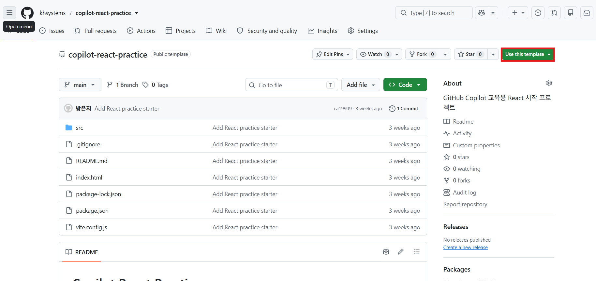
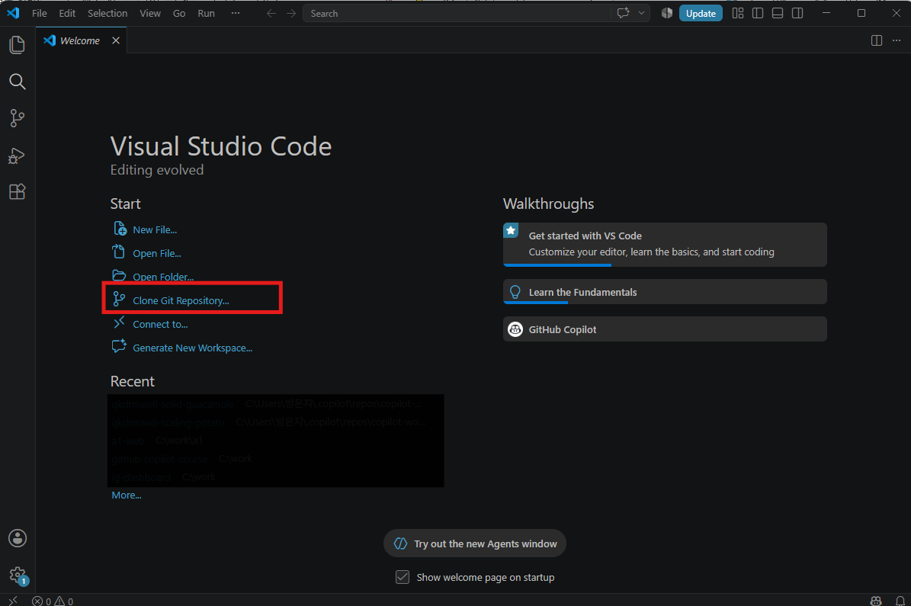

# STEP 03: Copilot으로 미니 웹앱 구현

## 학습 목표

준비된 React 프로젝트를 자신의 GitHub 저장소로 복사하고, Copilot Agent에게 실행과 기능 구현을 요청합니다.

## 실습 결과물

회의 전에 필요한 일을 적어 두는 간단한 체크리스트를 만듭니다.

완성된 웹앱에서는 다음 일을 할 수 있습니다.

- 준비할 일을 입력합니다.
- 입력한 일을 목록에 추가합니다.
- 끝낸 일에 완료 표시를 합니다.
- 모든 항목을 한 번에 지웁니다.

> [!TIP]
> 이번 실습의 목표는 React 문법을 외우는 것이 아닙니다. Copilot에게 요청하고, 계획을 확인하고, 구현을 맡기고, 결과를 직접 검증하는 과정을 익히는 것입니다.

## 연습 프로젝트를 내 저장소로 복사하기

이 실습에서는 설정이 끝난 [Copilot React Practice](https://github.com/khsystems/copilot-react-practice)를 사용합니다. **템플릿 저장소**는 같은 시작 파일을 내 GitHub 저장소로 복사해 주는 원본입니다. 내 저장소에서 작업해도 교육용 원본은 바뀌지 않습니다.

### 1단계: 연습 프로젝트 열기

브라우저에서 [Copilot React Practice](https://github.com/khsystems/copilot-react-practice)를 엽니다.

### 2단계: 내 저장소 만들기

페이지 위쪽의 **Use this template**를 누르고 **Create a new repository**를 선택합니다.



저장소 이름을 정한 뒤 공개 범위를 선택하고 **Create repository**를 누릅니다. 이름을 아직 정하지 못했다면 `my-copilot-project`를 사용해도 됩니다. 처음에는 **Private**으로 만들고, 공개해도 되는 내용인지 확인한 뒤 바꾸어도 됩니다.

### 3단계: 내 저장소 주소 복사하기

새로 만들어진 내 저장소에서 **Code** 버튼을 누릅니다. **HTTPS**가 선택된 상태에서 복사 버튼을 눌러 주소를 복사합니다.

### 4단계: Visual Studio Code로 가져오기

Visual Studio Code를 열고 **View → Command Palette**를 선택합니다. `Git: Clone`을 입력해 선택한 뒤, 복사한 저장소 주소를 붙여 넣습니다.



컴퓨터에서 저장할 위치를 고르고 복제가 끝나면 **Open**을 선택합니다. 복제(Clone)는 GitHub에 있는 저장소를 내 컴퓨터로 가져오는 작업입니다.

## 준비된 프로젝트 실행하기

### 1단계: Agent 선택하기

Copilot 채팅을 열고 모드 메뉴에서 **Agent**를 선택합니다. Agent는 대화에 답하는 것뿐 아니라, 사용자의 승인을 받아 파일과 실행 환경을 직접 다룰 수 있습니다.

### 2단계: 실행 요청하기

아래 내용을 복사해서 보냅니다.

```text
현재 열려 있는 연습 프로젝트를 실행하고 싶습니다.
필요한 작업을 먼저 설명하고, 제가 확인하면 실행해 주세요.
```

Agent가 실행할 작업을 설명하면 내용을 읽고 승인합니다. 처음 실행할 때는 필요한 파일을 준비하느라 잠시 걸릴 수 있습니다.

### 3단계: 시작 화면 확인하기

Agent가 알려 준 인터넷 주소를 누르거나 Edge 또는 Chrome의 주소창에 입력합니다. `React 연습 프로젝트가 준비되었습니다.`라는 문구가 보이면 실행 준비가 끝난 것입니다.

실습하는 동안 실행 중인 터미널은 닫지 않습니다.

## Plan 모드에서 기능 계획하기

### 1단계: Plan 선택하기

Copilot 채팅의 모드 메뉴에서 **Plan**을 선택합니다. Plan 모드는 파일을 바로 수정하지 않고 먼저 작업 계획을 만듭니다.

### 2단계: 계획 요청하기

아래 내용을 복사해서 보냅니다.

```text
현재 화면을 회의 준비 체크리스트로 바꾸고 싶습니다.

사용자는 준비 항목을 입력해 목록에 추가하고,
각 항목을 완료 표시하고, 전체 항목을 삭제할 수 있어야 합니다.
빈 내용은 추가되지 않아야 합니다.

현재 프로젝트의 기존 설정은 유지하고 새로운 프로그램은 추가하지 마세요.
어떤 순서로 만들지 계획을 세워 주세요.
```

### 3단계: 계획 확인하기

Copilot의 계획에서 다음 내용을 확인합니다.

- 요청한 네 가지 동작이 모두 포함되어 있는가?
- 로그인이나 알림처럼 요청하지 않은 기능이 추가되지 않았는가?
- 새로운 프로그램을 추가하지 않는가?
- 완성 후 확인 방법이 적혀 있는가?

모르는 표현이 있으면 다음과 같이 물어봅니다.

```text
계획에 나온 어려운 표현을 비개발자도 이해할 수 있게 설명해 주세요.
아직 구현은 시작하지 마세요.
```

### 4단계: 구현 시작하기

계획에 문제가 없다면 **Start Implementation**을 누릅니다. 버튼이 보이지 않으면 **Agent**를 선택하고 다음과 같이 요청합니다.

```text
확인한 계획대로 구현해 주세요.
완료되면 바꾼 내용과 확인 순서를 쉬운 말로 알려 주세요.
```

Agent가 파일이나 명령 실행 승인을 요청하면 목적을 읽고 승인합니다. 파일 삭제나 새로운 프로그램 추가가 포함되어 있다면 실행하지 말고 멘토에게 확인합니다.

## 만든 웹앱 확인하기

### 1단계: 브라우저 확인하기

처음 열어 둔 브라우저 화면을 확인합니다. 자동으로 바뀌지 않았다면 새로고침합니다. 화면을 닫았다면 Agent가 알려 준 주소를 다시 엽니다.

### 2단계: 직접 사용해 보기

다음 내용을 하나씩 확인합니다.

1. `회의 자료 준비`를 입력하고 추가합니다.
2. 추가된 항목을 완료 상태로 바꿉니다.
3. 아무것도 입력하지 않고 추가해 봅니다.
4. 전체 삭제 버튼을 누릅니다.

### 3단계: 바뀐 파일 이해하기

```text
이번에 수정한 파일의 이름과 역할을 표로 설명해 주세요.
각 파일이 화면과 기능에서 맡은 일을 쉬운 말로 알려 주세요.
파일은 더 수정하지 마세요.
```

파일 이름과 코드를 외울 필요는 없습니다. 어떤 파일이 화면, 동작, 모양을 담당하는지만 확인합니다.

## 문제 해결 가이드

- 저장소 복제가 되지 않으면 GitHub에 로그인되어 있는지 확인합니다.
- **Use this template**가 보이지 않으면 원본 저장소가 맞는지 주소를 다시 확인합니다.
- 시작 화면이 열리지 않으면 터미널의 오류를 복사해 Copilot에게 원인과 해결 순서를 물어봅니다.
- 버튼이 작동하지 않으면 어떤 버튼을 어떤 순서로 눌렀는지 Copilot에게 알려 줍니다.
- Agent가 파일 삭제나 새로운 프로그램 추가를 요청하면 승인하지 말고 멘토에게 확인합니다.

## 학습 완료 확인

- [ ] 템플릿으로 만든 내 GitHub 저장소를 Visual Studio Code에 가져왔습니다.
- [ ] Agent에게 실행 작업을 먼저 설명하게 한 뒤 승인했습니다.
- [ ] 브라우저에서 React 시작 화면을 확인했습니다.
- [ ] 파일을 수정하기 전에 Plan에서 계획을 확인했습니다.
- [ ] 항목 추가, 완료 표시, 전체 삭제가 작동합니다.
- [ ] 빈 내용은 추가되지 않습니다.
